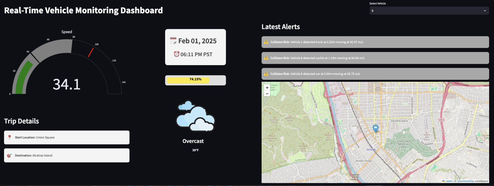

# Real-Time-Data-Pipeline-For-Monitoring-Autonomous-Vehicles
## **Overview**
This project showcases the infrastructure of a real-time data pipeline designed for autonomous vehicles. It simulates vehicle telemetry and sensor data using Python, streams the data into Apache Kafka topics, processes it with Apache Flink to generate real-time alerts, stores the processed data in TimescaleDB (PostgreSQL), and visualizes insights using Streamlit. The entire pipeline is containerized using Docker for seamless deployment and scalability.

## Architecture Diagram

## Pipeline Flow

### 1. Data Generation:
- Python scripts simulate real-time telemetry and sensor data.

### 2. Data Ingestion (Kafka):
- Data is streamed to Kafka topics:
  - `vehicle_telemetry`
  - `sensor_data`

### 3. Real-Time Processing (Flink):
- Flink consumes Kafka topics, processes data, and triggers alerts based on custom logic.

### 4. Data Storage (TimescaleDB/PostgreSQL):
- Processed data and alerts are stored in PostgreSQL time-series tables.

### 5. Visualization (Streamlit):
- Streamlit visualizes real-time data and alerts for monitoring and insights.

## Technologies Used

- **Python:**  
  Data simulation scripts to generate real-time telemetry and sensor data.

- **Apache Kafka:**  
  Data streaming and message brokering. Used to handle the data streams (`vehicle_telemetry`, `sensor_data`).

- **Apache Flink:**  
  Real-time stream processing and alert generation based on custom logic.

- **TimescaleDB (PostgreSQL):**  
  Time-series data storage for storing processed data and alerts.

- **Streamlit:**  
  Real-time interactive dashboard for visualizing telemetry, sensor data, and alerts.

- **Docker:**  
  Containerization and orchestration to deploy the services in a reproducible and scalable environment.

## Setup Instructions
### 1. Clone the Repository
First, clone the repository to your local machine:
```bash
git clone https://github.com/yourusername/autonomous-vehicle-data-pipeline.git
```
### 2. Start Docker Services
Ensure Docker is installed and running. Then execute the following command to start all services (Kafka, Flink, TimescaleDB, and Streamlit) in Docker containers:
```bash
docker-compose up --build
```
This will spin up the following services:

Kafka Broker for message streaming.
Apache Flink for real-time data processing and alert generation.
TimescaleDB (PostgreSQL) for storing time-series data.
Streamlit for the real-time data visualization dashboard.

### 3.Create Database Tables
Once the containers are up and running, connect to the TimescaleDB and run the SQL scripts to create the necessary tables:
```
docker exec -it timescale psql -U postgres -d postgres -f /path/to/sql/create_tables.sql
```
### 4. Create Kafka Topics
You need to create the Kafka topics for vehicle telemetry and sensor data. To do this, execute the following command from within the Kafka container:
```
docker exec -it kafka kafka-topics.sh --create --topic vehicle_data --bootstrap-server localhost:9092
docker exec -it kafka kafka-topics.sh --create --topic sensor_data --bootstrap-server localhost:9092
```
### 5. Run Simulation Scripts and Run Flink Job in cluster
```
simulation.py
flink_job.py
```
### 6. Access the Streamlit Dashboard
Run the dasboard file using streamlit and view it in the port 8501
```
streamlit run dashboard.py
```
This dashboard will display real-time data and alerts based on the processed data.

## Future Enhancements
- **Integrate Machine Learning Models in Flink** for real-time predictive analytics.
- **Implement Data Archiving Strategies** for long-term storage and efficient querying.
- **Use Apache Spark** for batch processing and historical data analysis.
- **Enhance Streamlit Dashboard** for real-time analytics and visualization.
- **Improve Data Security and Privacy** with encryption and access controls.
